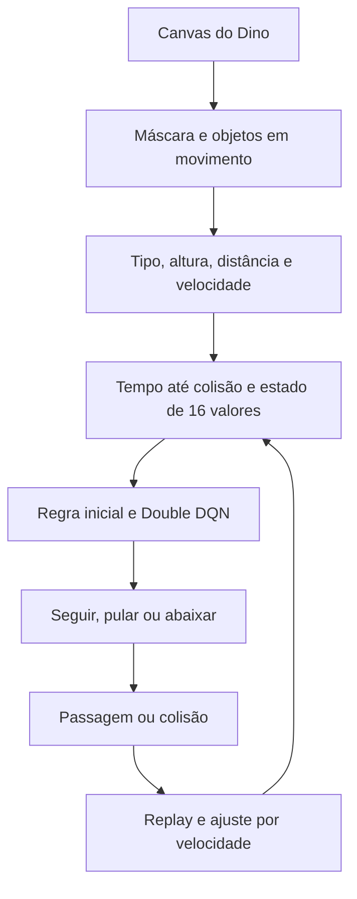

# Dino Vision RL

Agente experimental para o jogo do dinossauro do Google Chrome. Ele lê os pixels do canvas, identifica cactos e pterodátilos, estima a velocidade dos obstáculos e injeta comandos de teclado. Um controlador por tempo até a colisão fornece as decisões iniciais; uma rede **Double DQN em TensorFlow.js** aprende com as transições e pode refinar as decisões após reunir experiência.

O projeto é educacional. Não há promessa de atingir a pontuação máxima, e o contador de obstáculos do agente não é o placar oficial do Chrome.

## Execução

1. Abra `chrome://dino` no Chrome em um computador.
2. Abra o DevTools (`F12` ou `Cmd+Option+I`) e selecione **Console**. Se o navegador impedir a colagem, siga a instrução apresentada pelo próprio DevTools.
3. Copie **todo** o conteúdo de [`src/dino_rl.js`](src/dino_rl.js), cole no Console e execute.
4. Mantenha a aba visível. O script inicia o jogo, desenha caixas azul e vermelha para depuração e mostra as métricas no canto superior direito.

Também é possível salvar o mesmo código como um *Snippet* na aba **Sources** do DevTools para executá-lo novamente. TensorFlow.js é carregado pela CDN quando ainda não está presente na página; essa etapa requer conexão com a internet. O jogo pode estar offline, mas o carregamento da biblioteca não está incluído no arquivo.

Comandos disponíveis no Console:

```js
DinoRL5.status();      // Estado atual, velocidade e faixas de salto
DinoRL5.stop();        // Para e remove os elementos visuais
DinoRL5.start();       // Retoma após stop()
DinoRL5.exportModel(); // Baixa JSON e arquivo binário dos pesos da rede
DinoRL5.importModel(); // Seleciona os dois arquivos de um modelo compatível
```

Executar o script completo outra vez substitui a instância anterior e reinicia o treinamento. Os ajustes por velocidade permanecem entre colisões **durante a mesma execução da página**. A exportação atual salva somente os pesos da rede, não as correções das faixas, o replay ou as estatísticas. Um modelo exportado pelas versões anteriores com dimensão de estado diferente não é compatível.

## Como funciona



### Visão do canvas

O código obtém pixels com `getImageData` e constrói uma máscara da cor dos sprites. Ele procura primeiro o dinossauro na área esquerda; depois forma caixas de componentes à sua frente. O deslocamento horizontal de uma caixa entre observações confirma que se trata de um obstáculo em movimento e estima sua velocidade. Os filtros de cor, densidade, tamanho, posição, formato e movimento reduzem a chance de confundir nuvens, lua e paisagem com cactos ou aves.

Para a ave baixa, que ocupa parte da região próxima ao solo, a análise verifica uma faixa horizontal contínua do corpo. Isso ajuda a diferenciá-la de vários cactos agrupados. São heurísticas visuais, portanto outras versões do jogo, escalas e desenhos de sprite podem exigir recalibração.

### Velocidade e momento do salto

Se `d` é a distância horizontal entre o obstáculo e o dinossauro e `v` é a velocidade estimada em pixels por segundo, o tempo até a colisão é `TTC = d / v`. O salto é solicitado quando esse tempo alcança o limiar aprendido para a velocidade atual. A rede recebe tanto o TTC quanto a velocidade e sua variação recente.

O controlador mantém sete faixas de velocidade, entre 150 e 950 px/s, com tempos base entre 0,28 e 0,45 segundo. Os valores entre faixas são interpolados. Ao passar um obstáculo ou colidir após um salto, somente a faixa correspondente ao salto recebe um pequeno ajuste. Uma falha na partida recém reiniciada, ainda lenta, não altera a faixa de alta velocidade. O antigo teste de candidatos que trocava o tempo base global entre episódios foi removido.

### Pterodátilos

O jogo posiciona as aves em três alturas. A classificação usa a região vertical do sprite detectado no canvas; a ação depende dessa classificação:

| Altura detectada | Ação | Motivo |
| --- | --- | --- |
| Alta | Seguir | A ave passa acima do dinossauro em corrida. |
| Média | Abaixar | Mantém a tecla pressionada por mais alguns milissegundos durante a passagem. |
| Baixa | Pular | Trata o obstáculo como um salto e aplica o tempo da faixa de velocidade atual. |

O overlay e `DinoRL5.status().birdLevel` permitem conferir a classificação visual. A referência para as três posições e para a física do jogo é o [código do Chromium](https://chromium.googlesource.com/chromium/src/+/refs/tags/74.0.3719.3/components/neterror/resources/offline.js).

### Aprendizado por reforço

O espaço de ações tem três valores: `0` seguir, `1` pular e `2` abaixar. O estado tem 16 valores normalizados, incluindo TTC, distância, velocidade, dimensão e tipo do obstáculo, altura da ave, posição e movimento vertical do dinossauro, estado de abaixamento e informações sobre outro obstáculo à frente.

A política inicial usa regras geométricas. Após pelo menos **500 transições no replay** e **três obstáculos contabilizados**, a rede começa a participar das escolhas próximas a obstáculos. Há exploração epsilon-greedy de 0,12 até o mínimo de 0,03. Algumas ações incompatíveis com o obstáculo são bloqueadas: por exemplo, pular diante de uma ave alta ou abaixar diante de uma ave baixa.

A recompensa por frame ativo é `+0,002`; uma passagem confirmada rende `+1`, um salto tem pequeno custo de `-0,004` e a colisão recebe `-2`. O replay comporta 12.000 transições. Após cada episódio, o agente executa até dez lotes de treino de 32 amostras, com taxa de aprendizado de `0,0002`, fator de desconto `0,985` e sincronização periódica da rede alvo. A seleção da melhor ação no próximo estado usa a rede principal; a avaliação do valor usa a rede alvo, conforme a ideia de Double DQN.

O ajuste por faixa de velocidade e a rede neural são dois mecanismos complementares. O primeiro reage a resultados de saltos específicos; o segundo aprende a partir do replay. `mode: "reforco"` indica o modo do controlador, mas `batches: 0` significa que a rede ainda não recebeu lotes suficientes para treinar.

## Resultado observado

A captura do Console fornecida em **29/09/2026** mostra uma execução do agente com:

| Métrica observada | Valor |
| --- | ---: |
| Episódios encerrados | 38 |
| Melhor episódio, em obstáculos contabilizados | 133 |
| Média de obstáculos nos últimos 20 episódios | 57,1 |
| Lotes de treino acumulados | 390 |
| Exemplo de episódio longo | 248,0 s ativos e 97 obstáculos |
| Último episódio da captura | 55,5 s ativos e 54 obstáculos |

Esses dados vêm do log do script e são **observações de uma execução**, não uma avaliação com sementes controladas. `obstáculos` conta passagens estimadas pela visão e pode divergir do placar do jogo. O melhor episódio e a média não medem taxa de sucesso por tipo ou altura de obstáculo. A captura também mostra avisos de frames demorados (`requestAnimationFrame`), que podem afetar a leitura e a reação em tempo real. Ainda é necessário medir o desempenho em sessões adicionais no Chrome para comparar versões.

## Estrutura do repositório

```text
src/dino_rl.js          Script completo para colar no Console
tests/dino_rl.test.cjs Simulação do canvas e dos comandos de teclado
package.json           Atalho para executar a simulação com Node.js
README.md              Conceito, uso, implementação e resultados
```

Para executar o teste de simulação local:

```bash
npm test
```

O teste usa somente módulos nativos do Node.js e uma implementação simulada de TensorFlow.js. Ele verifica detecção da paisagem e de cactos agrupados; ave alta sem ação, média com abaixamento e baixa com salto; alteração da velocidade estimada; manutenção do ajuste após um reinício; e encerramento de episódio. O teste **não** mede desempenho no navegador real nem substitui uma execução com TensorFlow.js e sprites reais.

## Limitações e próximos experimentos

- A visão depende do canvas e pode falhar com temas, resolução, zoom ou versões diferentes do Chrome.
- O reconhecimento das alturas usa limiares geométricos; observar `birdLevel` e as caixas de depuração ajuda a detectar classificações incorretas.
- O treino ocorre na mesma thread da página. Frames longos prejudicam a medição de TTC.
- Pesos exportados não incluem o replay nem as correções por velocidade. Persistir o estado completo, sem depender de `localStorage` bloqueado, é uma evolução futura.
- O resultado máximo do jogo não foi alcançado ou demonstrado pelos dados disponíveis. Uma comparação séria exigiria várias execuções, registro do placar real e medidas separadas de cactos, aves altas, médias e baixas.

Projeto para estudo de visão computacional, controle e aprendizado por reforço em JavaScript.
